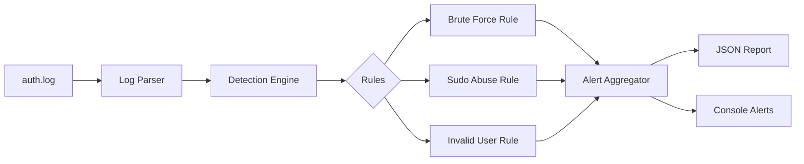

# 🛡️ Mini SOC: Security Monitoring & Incident Detection

A lightweight, modular Security Operations Center (SOC) tool built in Python. This system implements analyst-level detection logic to monitor Linux authentication logs for indicators of compromise (IoC).

## 🚀 Key Features
- **Time-Windowed Brute Force Detection**: Detects 5+ failures within a 60-second sliding window.
- **Noise Reduction**: Implements alert grouping to prevent console spamming during active attacks.
- **Context-Aware Sudo Monitoring**: Differentiates between standard usage and high-risk command execution (e.g., `/etc/shadow`).
- **Structured Incident Reporting**: Generates machine-readable JSON reports for automated response.

## 🗺️ MITRE ATT&CK® Mapping
| Technique | ID | Description |
| :--- | :--- | :--- |
| **Brute Force** | [T1110](https://attack.mitre.org/techniques/T1110/) | Automated password guessing against SSH. |
| **Valid Accounts** | [T1078](https://attack.mitre.org/techniques/T1078/) | Monitoring for successful vs failed logins. |
| **Abuse Elevation Control** | [T1548](https://attack.mitre.org/techniques/T1548/) | Detection of sensitive command execution via Sudo. |

## 🏗️ System Architecture


## 🛡️ Security Considerations
- **Detection Trade-offs**: The 60s window is designed to catch automated bots. A slow, stealthy brute-force attack (1 attempt every 5 minutes) would currently bypass this rule—this is a classic detection challenge.
- **False Positives**: Standard `sudo` usage is filtered out, but legitimate administrative tasks involving sensitive files may still trigger alerts.
- **Scalability**: For production environments with millions of logs, this Python list-based approach would be replaced by a high-performance database or SIEM (like ELK or Splunk).

## 🛠️ How to Run
```bash
python3 mock_log_gen.py  # Create test evidence
python3 main.py          # Run detection engine
```
Check `output/incident_report.json` for analysis results.
